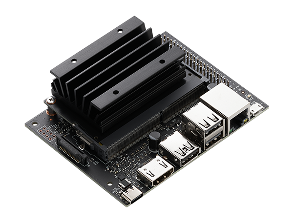

# Jetson Nano 2GB devkit - Ubuntu 20.04 + GPGPU packages
Everything to get the old Jetson Nano Developer Kit 2GB up and running with Ubuntu 20.04 and GPGPUs packages.

Here are the details of the board.
<table>
	<tr>
		<td>
			<table>
				<tr>
			      		<td><b>Name</b></td>
			      		<td>NVIDIA Jetson Nano 2GB Developer Kit</td>
			   	</tr>
			   	<tr>
			      		<td><b>Part</b></td>
			     	 	<td>p3448</td>
			   	</tr>
			   	<tr>
			      		<td><b>SoC</b></td>
			      		<td>tegra210 (codename: Batuu)</td>
			   	</tr>
				<tr>
					<td><b>CPU</b></td>
					<td>ARMv8 Processor rev 1</td>
				</tr>
      				<tr>
					<td><b>RAM</b></td>
					<td>2 GB LPDDR4</td>
				</tr>
				<tr>
			      		<td><b>Compute Cap.</b></td>
			      		<td>5.3 (architecture: Maxwell)</td>
			   	</tr>
			</table>
		</td>
		<td>
			
		</td>
	</tr>
</table>

Official docs are available [here](https://developer.nvidia.com/embedded/learn/get-started-jetson-nano-2gb-devkit).

This document describes how to create a bootable SD card image, update to Ubuntu 20.04 and install some libraries to exploit gpgpu computing both in python (e.g. numba, cupy, cudf) and c++ tool (nvcc, ecc). Also, directions to use distributed computing tools (dask, kafka) will be given. Specifically:
+ numba 0.56.4
+ cupy 12.3.0
+ pyarrow 1.0.1
+ cudf 0.19.0

### 1) Intro - The board, drivers, CUDA and Ubuntu

1. This board is centered around the Tegra X1 SoC that includes the processor (an early ARM v8 so unfortunately no SVE instructions, etc) and the GPU which is a nice 128 cores Maxwell device with compute capability 5.3. The GPU is technically an iGPU (integrated) and as such it is not a discrete device attached to the pci-e bus. This is a crucial point since the "discrete" nvidia drivers <b>won't work</b> with this gpu, even if the architecture is exactly the same to that of a discrete Maxwell gpu.
The only drivers that will work are those provided by nVidia in their "Linux 4 Tegra" (<b>L4T</b>) flavour of the Linux kernel. Since the driver version and the CUDA version must exactly match, no CUDA greater than 10.2 is supported on these devices. While the Maxwell architecture can run much higher CUDA versions, because of the gpu being integrated and the drivers being built-in in the L4T kernel, unless nvidia releases a new kernel with updated drivers, it is not possible to run CUDA beyond 10.2 (if one attempts to use a version > 10.2, the iGPU will fail to initialize and will result in random crashes, effectively breaking the system).

2. The board also does not have a BIOS/EFI chip, but it uses a special partition on the SD card (more on this later on) in order to boot the device (other jetson nano's with different SoC have instead a flash chip where the bios/efi subsystem resides, this is not the case with the 2GB developer's version).

3. With respect to the OS, nvidia officially supports only Ubuntu 18. While it is not necessary, it can be updated to Ubuntu 20.04 so as to obtain updated versions of some system libraries that are quite useful for a variety of tasks. The procedure to update the os is described later.

### 2) Creating a bootable SD card and first boot
#### 2.1) Using Nvidia's sdkmanager (requires user registration)

The easiest way to do this is to set up a virtual machine (e.g. VMware) with Ubuntu 18. Once you have it up and running, install the `sdkmanager` by Nvidia. While this wouldn't be necessary, since you can also download all that is needed to build the sd-card image from Nvidia website, it is highly recommended because the sdkmanager will download some additional dependencies that will prevent the system from breaking when updating from Ubuntu 18 to Ubuntu 20.04. After you've installed sdkmanager, run it choosing the correct board and JetPack version (`4.6.4`). You can check only the `Jetson OS` options and uncheck the others. This will build the image, but we'll need to modify some things about it manually. When prompted to flash the device, hit `Skip`.

Open a terminal inside Nvidia's sdk folder and look for the `Linux_for_Tegra` folder. Once there, go inside `tools` and run these scripts:
1. Create a user:
   ```bash
   sudo ./l4t_create_default_user.sh -u jetson -p jetson -n jetson --accept-license --autologin
   ```
2. Create the bootable image:
   ```bash
   sudo ./jetson-image-disk-creator.sh -o sd-blob.img -b jetson-nano-2gb-devkit
   ```
Once you've done this, you can use a tool like `balena etcher` to write `sd-blob.img` to SD card:
1. <b>Before you flash the card</b>: do a low level format, without partitioning (easy via tools like `Disks` on Ubuntu). This is absolutely mandatory otherwise the system won't boot correctly.
2. Flash the image on the card.
3. Place the card in the Jetson and power it up. The first boot will show some errors, ignore them. It will reboot automatically.

#### 2.2) Manual download of components (no user registration required)

1. Go [here](https://developer.nvidia.com/embedded/linux-tegra-r3274) and download the [Driver Package (BSP)](https://developer.nvidia.com/downloads/embedded/l4t/r32_release_v7.4/t210/jetson-210_linux_r32.7.4_aarch64.tbz2) and the [Sample Root Filesystem](https://developer.nvidia.com/downloads/embedded/l4t/r32_release_v7.4/t210/tegra_linux_sample-root-filesystem_r32.7.4_aarch64.tbz2).

2. Untar the `Driver Package` with the following:
   ```bash
   sudo tar -xpf <filename>.tbz2
   ```
   it is <b>extremely</b> important to untar as sudo and to use the `-xpf` flags. Otherwise, permissions will be screwed up and the subsequent actions won't work. This will create a folder named `Linux_for_Tegra`.

3. Move the `Sample Root Filesystem`'s tar inside `Linux_for_Tegra/rootfs` and untar it there:
   ```bash
   sudo tar -xpf <filename>.tbz2
   ```

4. Go inside the `Linux_for_Tegra` directory and launch, as sudo, the `apply_binaries.sh` script. <b>Do it ONLY ONCE</b> otherwise the image will be corrupted!

5. Go inside the `Linux_for_Tegra/tools` directory and run, as sudo, the `l4t_create_default_user.sh` script with the followings args:
   ```bash
   -u : specifies the user name (e.g. jetson)
   -p : specifies the password (e.g. jetson)
   -n : specifies the host name (e.g. jetson)
   --accept-license : already accepts the license so that the system is ready to go
   --autologin : if you want the system to autologin
   ```

6. Build the image by running, as sudo, script `jetson-disk-image-creator.sh` with the options:
   ```bash
   -o : output file (must end with .img extension)
   -b : must be exactly jetson-nano-2gb-devkit
   ```
After this, you can place the card in the jetson and boot.

### 3) Prepare system for update

First thing to do, as usual:
```bash
sudo apt update
sudo apt upgrade
```
Remove chromium browser since otherwise it will cause problems during the update:
```bash
sudo apt --purge remove chromium-browser
```

#### 3.1) Install JetPack 4.6.4
```bash
sudo apt install nvidia-jetpack
```
The jetpack also installs all of the remaining `nvidia-l4t` packages that are needed. Edit the `.bashrc` file and add these lines at the end:
```bash
export CUDA_HOME=/usr/local/cuda
export PATH=/usr/local/cuda/bin:$PATH
export LD_LIBRARY_PATH=/usr/local/cuda/lib64:$LD_LIBRARY_PATH
```

#### 3.2) Disable the graphical user interface
```bash
sudo systemctl set-default multi-user.target
```
and reboot the board.

#### 3.3) Unlock the release advancement option

Edit the file at `/etc/update-manager/release-upgrades`, changing the last line to `Prompt=lts`.

### 4) Upgrade

<hr>
<b>⚠️Warning⚠️</b>

If you used the second method to build the sd-card image, before you proceed you must edit the `/etc/apt/apt.conf.d/01autoremove` file adding these lines:

```bash
	"libnvidia-container-tools";
	"libnvidia-container0";
	"libnvidia-container1";
	"nvidia-container";
	"nvidia-container-csv-cuda";
	"nvidia-container-csv-cudnn";
	"nvidia-container-csv-tensorrt";
	"nvidia-container-csv-visionworks";
	"nvidia-container-runtime";
	"nvidia-container-toolkit";
	"nvidia-cuda";
	"nvidia-cudnn8";
	"nvidia-docker2";
	"nvidia-jetpack";
	"nvidia-l4t-3d-core";
	"nvidia-l4t-apt-source";
	"nvidia-l4t-bootloader";
	"nvidia-l4t-camera";
	"nvidia-l4t-configs";
	"nvidia-l4t-core";
	"nvidia-l4t-cuda";
	"nvidia-l4t-firmware";
	"nvidia-l4t-gputools";
	"nvidia-l4t-graphics-demos";
	"nvidia-l4t-gstreamer";
	"nvidia-l4t-init";
	"nvidia-l4t-initrd";
	"nvidia-l4t-jetson-io";
	"nvidia-l4t-jetson-multimedia-api";
	"nvidia-l4t-kernel";
	"nvidia-l4t-kernel-dtbs";
	"nvidia-l4t-kernel-headers";
	"nvidia-l4t-libvulkan";
	"nvidia-l4t-multimedia";
	"nvidia-l4t-multimedia-utils";
	"nvidia-l4t-oem-config";
	"nvidia-l4t-tools";
	"nvidia-l4t-wayland";
	"nvidia-l4t-weston";
	"nvidia-l4t-x11";
	"nvidia-l4t-xusb-firmware";
	"nvidia-nsight-sys";
	"nvidia-opencv";
	"nvidia-tensorrt";
	"nvidia-visionworks";
	"nvidia-vpi";
	"libdrm-tegra0";
	"nsight-systems-linux-tegra-public-2021.5.4.19-e642d4b";
```
to both the `NeverAutoRemove` and `Never-MarkAuto-Sections`. This will prevent the updater from removing these packages (it will otherwise cause a kernel panic and break the system on reboot).

<hr>

To launch the upgrade, it is best to connect a keyboard to the Jetson and an HDMI monitor. Then launch the hideous command:
```bash
sudo do-release-upgrade
```

During the procedure you might be prompted about what to do with several configuration files. Just go for the default option.

<b>⚠️ At the end, it should ask you whether you want to remove obsolete software. Do not remove it (just type enter) otherwise some of Nvidia's proprietary stuff will get deleted and the system will break.⚠️</b>

Once the system reboots (hopefully), try:
```bash
sudo apt update
```
If the command fails due to broken packages, then repair them:
```bash
sudo dpkg --configure -a
```
should do the trick.

### 5) Installing software
#### 5.1) Install htop and pip
```bash
sudo apt install htop
sudo apt install python3-pip
```

#### 5.2) Installing Miniforge package manager

Since the CPU's architecture is too old to run Anaconda or Miniconda, the other option is miniforge3. You can get it from here and install it via the script:
```bash
wget https://github.com/conda-forge/miniforge/releases/latest/download/Miniforge3-Linux-aarch64.sh
```
Then, create a new environment, I called it `gpudist`, with `python3.9`:
```bash
conda create --name=gpudist python=3.9
```

#### 5.3) Install `jetson-stats` and `jtop`
Install now the `jetson-stats` pip package from the `base` environment:
```
sudo pip3 install -U jetson-stats
```
and reboot the board. Then activate the `gpudist` env and run:
```
pip3 install jetson-stats
```
this will install the `jtop` python's module that will be useful later.

#### 5.4) Install `numba` and `cupy` with GPU support

To install numba, we'll have to get the highest version that supports CUDA 10.2 that is the 0.56.4. So:
```bash
conda install numba=0.56.4
```
and then test it opening a python session:
```bash
from numba import cuda
cuda.is_available()
cuda.detect()
```
this should look like:
```bash
Python 3.9.19 | packaged by conda-forge | (main, Mar 20 2024, 13:51:08) 
[GCC 12.3.0] on linux
Type "help", "copyright", "credits" or "license" for more information.
>>> from numba import cuda
>>> cuda.is_available()
True
>>> cuda.detect()
Found 1 CUDA devices
id 0      b'NVIDIA Tegra X1'                              [SUPPORTED]
                      Compute Capability: 5.3
                           PCI Device ID: 0
                              PCI Bus ID: 0
                                    UUID: GPU-a220528a-4ef6-34d2-ac51-72ebc267ecf9
                                Watchdog: Enabled
             FP32/FP64 Performance Ratio: 32
Summary:
	1/1 devices are supported
True
>>> 
```
Now it's time for `cupy` with GPU support. It is quite easy:
```bash
pip install cupy-cuda102
```
To test it open a python session and:
```bash
from cupy import cuda
```
if it doesn't show errors, then it works.

### 6) Building Arrow

Before doing anything, we have to use a version of gcc/g++ that is `≤ 8`. Install `g++-8` via apt and then, after having removed `/usr/bin/gcc` and `/usr/bin/g++` do:
```bash
sudo ln -s gcc-8 /usr/bin/gcc
sudo ln -s g++-8 /usr/bin/g++
```

#### 6.1) Prerequisites

Install `CMake` version `3.18` via conda:
```bash
conda install cmake=3.18
```

Then, clone `Arrow` repo via git and checkout version `1.0.1`:
```bash
git clone https://github.com/apache/arrow.git
cd arrow
git checkout apache-arrow-1.0.1
```
Go inside the `arrow` folder, and create the `dist` folder. Edit the `.bashrc` file and add, assuming arrow is in $HOME:
```bash
export ARROW_HOME=${HOME}/arrow/cpp
export LD_LIBRARY_PATH=${HOME}/arrow/cpp/lib:$LD_LIBRARY_PATH
```
reload the `.bashrc` so that these vars will be exported.

#### 6.2) Download and build Boost libraries

We need boost version 1.71.0 which can be downloaded directly:
```bash
wget https://archives.boost.io/release/1.71.0/source/boost_1_71_0.tar.gz
```
go inside `boost_1_71_0` folder and run the bootstrap script:
```bash
mkdir install
./bootstrap.sh --prefix=${PWD}/install --exec-prefix=${PWD}/install
```
this will build the `b2` program. Start the build via:
```bash
./b2 -j4
```
at this point, assuming you've got the boost libs in `$HOME/boost_1_71_0`, you'll have the include path in `$HOME/boost_1_71_0` (folder `boost`) and the lib path in `$HOME/boost_1_71_0/stage/lib`. We can thus add to the bashrc the following lines:
```bash
export LD_LIBRARY_PATH=/path/to/boost/boost_1_71_0/stage/lib:$LD_LIBRARY_PATH
export BOOST_ROOT=/path/to/boost/boost_1_71_0
export BOOST_INCLUDEDIR=/home/jetson/boost_1_71_0/boost
export BOOST_LIBRARYDIR=/home/jetson/boost_1_71_0/stage/lib
```
these vars will be used in the following to build Arrow. Also, create two links:
```
ln -s ${BOOST_ROOT}/boost ${BOOST_ROOT}/include
ln -s ${BOOST_ROOT}/stage/lib ${BOOST_ROOT}/lib
```
these will be useful since some packages like to find boost libs at those locations.

#### 6.3) Configure cmake for Arrow
Now go to `${ARROW_HOME}/cpp/thirdparty`. You'll see a file named `versions.txt`. Open it and in the `DEPENDENCIES` section below, delete the entry corresponding to `boost`, since we've already installed it. Also, in the line corresponding to `c-ares`, substitute the link with this static one: `https://github.com/c-ares/c-ares/releases/download/cares-1_16_1/c-ares-1.16.1.tar.gz`. Save the file and run the `donwload_dependencies.sh` script.

Proceed to build and install `thrift` manually, since it fails in the automated procedure. Go in `${ARROW_HOME}/cpp/thirdparty` and untar the `thrift` tarball. Then go inside its folder and:

After that, configure with:
```bash
mkdir install
./bootstrap.sh
./configure CPPFLAGS="-I${BOOST_ROOT}" --with-boost=${BOOST_ROOT} --prefix=${PWD}/install
make -j4
sudo make install
export THRIFT_ROOT=${PWD}/install
```
Now, edit the `versions.txt` file again and remove the line corresponding to `thrift` in the `DEPENDENCIES` section.

Now, go back in the `cpp` folder and create a `build` dir, go inside that and type:
```bash
cmake	-DCMAKE_INSTALL_PREFIX=${ARROW_HOME} \
	-DCMAKE_CXX_FLAGS="-I${CONDA_PREFIX}/include" \
	-DARROW_COMPUTE=ON \
	-DARROW_CSV=ON \
	-DARROW_CUDA=ON \
	-DARROW_FILESYSTEM=ON \
	-DARROW_ORC=ON \
	-DARROW_PARQUET=ON \
	-DARROW_PYTHON=ON \
	-DARROW_DATASET=ON \
	-DARROW_HDFS=ON \
	-DARROW_JSON=ON \
	-DARROW_BUILD_BENCHMARKS=OFF \
	-DARROW_BUILD_EXAMPLES=OFF \
	-DARROW_BUILD_TESTS=OFF \
	-Dabsl_SOURCE=BUNDLED \
	-DAWSSDK_SOURCE=BUNDLED \
	-Dbenchmark_SOURCE=BUNDLED \
	-DBoost_SOURCE=SYSTEM \
	-DBrotli_SOURCE=BUNDLED \
	-DBZip2_SOURCE=BUNDLED \
	-Dc-ares_SOURCE=BUNDLED \
	-Dgflags_SOURCE=BUNDLED \
	-Dglog_SOURCE=BUNDLED \
	-Dgoogle_cloud_cpp_storage_SOURCE=BUNDLED \
	-DgRPC_SOURCE=BUNDLED \
	-DGTest_SOURCE=BUNDLED \
	-Djemalloc_SOURCE=BUNDLED \
	-DLLVM_SOURCE=BUNDLED \
	-DLz4_SOURCE=BUNDLED \
	-Dnlohmann_json_SOURCE=BUNDLED \
	-Dopentelemetry-cpp_SOURCE=BUNDLED \
	-DORC_SOURCE=BUNDLED \
	-Dre2_SOURCE=BUNDLED \
	-DProtobuf_SOURCE=BUNDLED \
	-DRapidJSON_SOURCE=BUNDLED \
	-DSnappy_SOURCE=BUNDLED \
	-DSubstrait_SOURCE=BUNDLED \
	-DThrift_SOURCE=SYSTEM \
	-Ducx_SOURCE=BUNDLED \
	-Dutf8proc_SOURCE=BUNDLED \
	-Dxsimd_SOURCE=BUNDLED \
	-DZLIB_SOURCE=BUNDLED \
	-DZSTD_SOURCE=BUNDLED \
	-DBoost_ROOT=${BOOST_ROOT} \
	-DThrift_ROOT=${THRIFT_ROOT} \
	-DTHRIFT_STATIC_LIB=${THRIFT_ROOT}/lib \
	..
```
cmake could produce some warning due to some variables not being used. Don't worry about them.

Before going on and making arrow, go in the `src/parquet/CMakeFiles/parquet_shared.dir` folder. You'll see these files:
```bash
-rw-rw-r--  1 jetson jetson  729 Jun 15 11:27 DependInfo.cmake
-rw-rw-r--  1 jetson jetson 9994 Jun 15 11:27 build.make
-rw-rw-r--  1 jetson jetson  324 Jun 15 11:33 cmake_clean.cmake
-rw-rw-r--  1 jetson jetson   98 Jun 15 11:27 depend.make
-rw-rw-r--  1 jetson jetson 1593 Jun 15 11:27 flags.make
-rw-rw-r--  1 jetson jetson 2193 Jun 15 11:27 link.txt
-rw-rw-r--  1 jetson jetson   21 Jun 15 11:33 progress.make
```
Consider `build.make` and `link.txt`. Edit `build.make` and around line `149` you should see a line similar to this: 
```cmake
release/libparquet.so.100.1.0: ../thirdparty/thrift-0.12.0/install/lib
```
comment this line out or delete it altogether. Then open `link.txt` and go at the end of the line. Start to scan the line backwards until you come across `../../orc_ep-install/lib/liborc.a`. If you continue scanning backward a bit you'll see that you'll find something like the line you just commented in the other file. Delete that chunk and save the file.

After that, proceed with the build:
```bash
make -j4
make install
```
After that, go in the `arrow/python` folder. Set this env vars:
```bash
export PYARROW_WITH_CUDA=1
export PYARROW_WITH_PARQUET=1
export PYARROW_WITH_ORC=1
```
Install `cython` version `0.29`. This is very important since newer versions won't work.
```
conda install cython=0.29
```
Now, edit the `SetupCxxFlags.cmake` script inside `python/cmake_modules`. The Jetson's a little picky with processor architecture. Go at line 76 and comment the two lines that are there and write this instead:
```cmake
set(CXX_SUPPORTS_ARMV8_ARCH 1)
```
Now you can run the setup with the following (it will build with only one core which is good since it requires a lot of memory and the Jetson doesn't have nearly as much to do it with more than one):
```bash
python setup.py build_ext --build-type=release --bundle-arrow-cpp bdist_wheel
```
After this completes, you'll find the wheel inside the `dist` folder. Go in that folder and (in my case):
```bash
pip install pyarrow-1.0.1.dev0+g886d87bde.d20240614-cp39-cp39-linux_aarch64.whl
```
Open a python session and try the following:
```bash
import pyarrow
from pyarrow import cuda
```
If it doesn't give any errors, then you're good and pyarrow is installed correctly in the system.

### 7) Building cuDF
Start by cloning cuDF's repo:
```bash
git clone https://github.com/rapidsai/cudf.git
cd cudf
git checkout v0.19.0
```
Now we have to install some packages.

#### 7.1) Build Pandas

We'll need version `1.2.4` exactly.
```bash
cd $HOME
mkdir pandas_src && cd pandas_src
git clone https://github.com/pandas-dev/pandas.git
cd pandas
git checkout v1.2.4
python setup.py install
```

#### 7.2) Build DLpack

We will need version `0.3`.
```bash
git clone https://github.com/dmlc/dlpack.git
cd dlpack
git checkout v0.3
mkdir install
mkdir build && cd build
cmake -DCMAKE_INSTALL_PREFIX=${PWD}/../install ..
make -j4
make install
```
Then, export this var:
```bash
export DLPACK_ROOT=/your/path/to/dlpack
```

#### 7.3) Build RMM

RMM needs to be of the same version of `cuDF` (0.19.0).
```bash
git clone --recurse-submodules https://github.com/rapidsai/rmm.git
cd rmm
git checkout v0.19.0
mkdir install
mkdir build && cd build
```
Now, even if `rmm/cmake/Modules/SetGPUArchs.cmake` file, at line 17, does not contain "53" in the list of supported architectures, it doesn't matter because we're going to force it:
```bash
# now force the compilation for the current arch only (53)
cmake -DCMAKE_INSTALL_PREFIX=${PWD}/../install -DCMAKE_CUDA_ARCHITECTURES="" ..
make -j4
make install
cd ..
export RMM_ROOT=${PWD}
export LD_LIBRARY_PATH=${PWD}/install/lib:$LD_LIBRARY_PATH
```
Then, install also the python module. Go in the `rmm/python` folder. The `setup.py` file needs a little editing since, as you may expect, CUDA for the Tegra SoC is a little different.

+ go at line 56 and add below the following:
  ```python
  cuda_stubs_dir = os.path.join(CUDA_HOME, "lib64/stubs")
  ```
+ go at line 60 and edit the line so that it will look like this:
  ```python
  INSTALL_PREFIX = os.environ.get("RMM_ROOT", False)
  ```
+ go now at line 116 and add to the `library_dirs` list the `cuda_stubs_dir` so that it will look like this:
  ```python
  library_dirs = [
    	get_python_lib(),
    	os.path.join(os.sys.prefix, "lib"),
    	cuda_lib_dir,
    	cuda_stubs_dir,
  ]
  ```

Now you're ready to do the following:
```bash
python setup.py build_ext --inplace
python setup.py install
```

#### 7.4) Build cuDF

<b>⚠️Warning⚠️</b>

In order to build cuDF you're going to need a 10 GB swap file/partition. If you are using a 32 GB card, there won't be enough space at this point. So, clone the card onto a 64 GB one and create a swap partition in the 32 GB unallocated space and then put the 64 GB card in the board. At this point you can build cuDF. When you're done building cuDF, clone the 32 GB partition back on the old 32 GB card.

Export this variable:
```bash
export CUDF_HOME=/your/path/to/cudf/download
```
Then proceed:
```bash
cd $CUDF_HOME/cpp
mkdir install
mkdir build && cd build
```
And build `cuDF`:
```bash
cmake	-DMAKE_INSTALL_PREFIX=${PWD}/../install \
	-DCMAKE_CXX11_ABI=ON \
	-DRMM_INCLUDE=${RMM_ROOT}/include \
	-DDLPACK_INCLUDE=${DLPACK_ROOT}/include \
	-DGPU_ARCHS="" \
	-DCMAKE_CUDA_ARCHITECTURES="" \
	..
make -j1
```
The build will take anything from 18 to 24 hours. After this is completed we can proceed to build the python modules.

### 8) Dask

